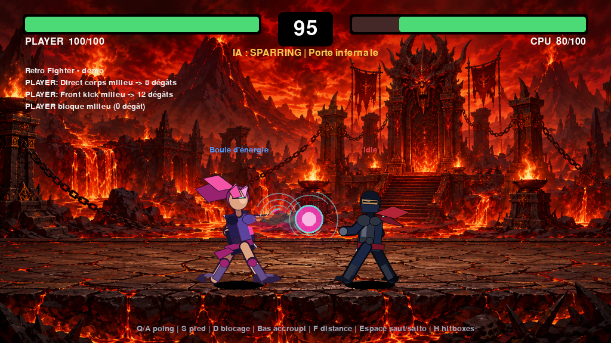
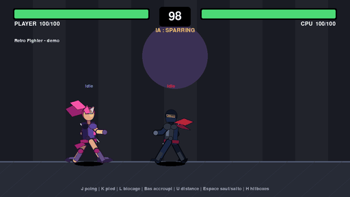

# Retro Fighter — prototype Python/Pygame

Prototype jouable d'un jeu de combat 2D rétro inspiré des bases de Street Fighter.

Les personnages sont rendus à partir de sprites (voir [Personnages](#personnages)) ; le décor, les barres de vie, les hitboxes et les effets visuels restent dessinés en formes simples avec Pygame.

## Jouer dans le navigateur

**[phileas-condemine.github.io/retro-fighter](https://phileas-condemine.github.io/retro-fighter/)**

Build web généré par [Pygbag](https://github.com/pygame-web/pygbag) (Python/Pygame-ce compilé en WebAssembly) et déployé automatiquement sur GitHub Pages à chaque push sur `master` (voir `.github/workflows/deploy-pygbag-pages.yml`). Le premier chargement peut prendre quelques dizaines de secondes (téléchargement du runtime Python WebAssembly) ; les chargements suivants sont mis en cache par le navigateur.

## Aperçu





*Démo générée par un script rejouant la partie via le vrai moteur du jeu (`retro_fighter.game.Game`), montrant poing, pied, blocage, accroupissement, attaque à distance et un salto (double saut) passant par-dessus l'adversaire.*

## Fonctionnalités déjà implémentées

- Combat 2D à gauche/droite avec deux personnages.
- Joueur humain au clavier.
- Adversaire contrôlé par IA.
- 4 modes IA : sparring, facile, moyen, difficile.
- Déplacement latéral.
- Saut.
- Coup de poing et coup de pied.
- Trois hauteurs d'attaque : haut, milieu, bas.
- Blocage maintenu avec trois hauteurs : haut, milieu, bas.
- Différence poing/pied :
  - poing : plus rapide, moins de portée, moins de dégâts ;
  - pied : plus lent, plus de portée, plus de dégâts.
- Hitstun : un personnage touché est interrompu et ne peut plus attaquer pendant 0,5 seconde (le premier coup qui touche prend l'avantage).
- Blockstun : un personnage qui bloque correctement subit un court blocage, sans dégât.
- Accroupissement (`↓` seul au sol) : hurtbox à mi-hauteur, esquive les coups hauts et les projectiles à hauteur d'épaules.
- Double saut avec salto : passe par-dessus l'adversaire (ou un projectile assez haut) et inverse les côtés.
- Attaque à distance par personnage : shuriken (shinobi) et boule d'énergie rose (rose_kunoichi).
- Barre de vie, timer, messages de combat.
- Overlay de pause.
- Affichage optionnel des hitboxes/hurtboxes.
- Menu de sélection du niveau d'IA.

## Installation

Prérequis : Python 3.10 ou plus récent.

Dans un terminal :

```bash
cd retro_fighter_project
python -m venv .venv
```

Puis active l'environnement virtuel.

Sur Windows PowerShell :

```powershell
.venv\Scripts\Activate.ps1
```

Sur macOS/Linux :

```bash
source .venv/bin/activate
```

Installe les dépendances :

```bash
pip install -r requirements.txt
```

## Lancer le jeu

```bash
python run_game.py
```

### Build web locale (Pygbag)

`main.py` est le point d'entrée requis par [Pygbag](https://github.com/pygame-web/pygbag) pour le build WebAssembly (boucle async, voir `Game.tick()` dans `retro_fighter/game.py` — la même méthode alimente `run_game.py` en desktop et `main.py` en web, donc aucune logique dupliquée). Pour tester en local avant de pousser :

```bash
python -m pip install pygbag
python -m pygbag .          # serveur local sur http://localhost:8000
python -m pygbag --build .  # build statique dans build/web/, sans lancer de serveur
```

`pygbag.ini` exclut du build web les dossiers/fichiers qui ne sont pas nécessaires à l'exécution (`.venv/`, `docs/`, `scripts/`, `inspiration_graphique/`, docs de packs, fichiers projet). `build/` n'est pas versionné : il est régénéré par `.github/workflows/deploy-pygbag-pages.yml` à chaque push sur `master`.

## Contrôles

| Action | Touche |
|---|---|
| Déplacement gauche/droite | Flèches gauche/droite |
| Viser haut | Flèche haut maintenue |
| Viser bas | Flèche bas maintenue |
| Viser milieu | aucune flèche haut/bas |
| Coup de poing | J |
| Coup de pied | K |
| Blocage maintenu | L |
| Saut / double saut (salto) | Espace |
| Accroupissement | ↓ (seul, au sol) |
| Attaque à distance | U |
| Pause | P |
| Reset round | R |
| Afficher/cacher hitboxes | H |
| Quitter | Échap |

### Hauteur des attaques et blocs

- `J` seul : coup de poing milieu.
- `↑ + J` : coup de poing haut.
- `↓ + J` : coup de poing bas.
- `K` seul : coup de pied milieu.
- `↑ + K` : coup de pied haut.
- `↓ + K` : coup de pied bas.
- `L` seul : blocage milieu.
- `↑ + L` : blocage haut.
- `↓ + L` : blocage bas.
- `↓` seul (sans attaque ni blocage) : accroupissement. `↓ + ←/→` : déplacement accroupi (plus lent).

En l'air, une fois le premier saut lancé, `Espace` déclenche un second saut avec une animation de salto, tant qu'il n'a pas déjà été utilisé depuis l'atterrissage.

## Personnages

Deux packs de 60 frames chacun, sous `assets/fighters/` :

| Côté | Personnage | Dossier |
|---|---|---|
| Joueur (gauche par défaut) | Rose Kunoichi | `assets/fighters/rose_kunoichi/` |
| CPU (droite par défaut) | Shinobi | `assets/fighters/shinobi/` |

Chaque pack fournit un `manifest.json` (animations, FPS, boucle, ancre) consommé par `retro_fighter/sprites.py`. Les frames sont dessinées orientées vers la droite ; le personnage de droite (ou tout personnage qui change de côté, par exemple via le double saut) est simplement retourné à l'affichage (`pygame.transform.flip`) selon `fighter.facing`, sans copie miroir séparée sur disque.

Chaque pack a aussi un ou plusieurs fichiers `extension_manifest*.json` (accroupissement, salto, charge/lancer à distance, attaques basses depuis l'accroupi) fusionnés automatiquement au chargement par `FighterSpriteSet` (voir `assets/extension_pack_docs/*/docs/MANIFEST_MERGE.md`).

Un coup de poing ou de pied bas déclenché depuis l'accroupi (`↓` maintenu) garde une pose accroupie (`crouch_punch_low`/`crouch_kick_low`) plutôt que de se relever puis se rebaisser visuellement ; les dégâts/timing restent ceux de l'attaque basse standard (`attacks.py`), seule la pose change.

### Attaques à distance

Chaque personnage a son propre projectile, défini dans `retro_fighter/projectiles.py` (même esprit data-driven que `attacks.py`) :

| Personnage | Projectile | Dégâts | Vitesse |
|---|---|---:|---:|
| `shinobi` | Shuriken | 8 | 560 px/s |
| `rose_kunoichi` | Boule d'énergie | 10 | 455 px/s |

Touche `U` : charge (`ranged_charge`) puis lance (`ranged_throw`) à hauteur d'épaules. Règles de collision :

- accroupissement : esquive (la hurtbox réduite passe sous le projectile, aucune règle spéciale nécessaire) ;
- salto (double saut) suffisamment haut (`PROJECTILE_AVOID_Y_DELTA` dans `config.py`) : esquive ;
- blocage haut ou milieu : bloqué, 0 dégât ;
- sinon : touche, hitstun standard (0,5 s).

Les sprites des projectiles sont sous `assets/projectiles/`.

### Son

Tous les sons viennent de sources réelles tierces (voir `assets/audio/LICENSE_AUDIO.md`), sourcées via `retro_fighter_real_audio_pack_v3` (`assets/audio/docs/real_audio_pack_v3/`). Le son est composé de deux couches jouées en même temps (`retro_fighter/audio.py`, `SoundBank`) :

- **voix par personnage**, sous `assets/audio/fighters/<audio_id>/voice_only/` :

  | Personnage (id sprite) | Dossier audio | Source voix |
  |---|---|---|
  | `rose_kunoichi` | `assets/audio/fighters/rose_kunoichi/voice_only/` | Female RPG Voice Starter Pack (cicifyre), CC0 |
  | `shinobi` | `assets/audio/fighters/shinobi_male/voice_only/` | VoiceBosch Effort Sounds (Male), CC-BY-SA 4.0 |

  8 événements par personnage : `punch`, `kick`, `jump`, `double_jump`, `landing`, `block`, `hurt`, `projectile_throw`.

- **sons communs**, sous `assets/audio/fighters/common/` (Kenney Sound Pack, CC0) : impacts (`punch_hit`, `kick_hit`, `block_impact`), déplacements (`jump_whoosh`, `double_jump_whoosh`, `landing`, `attack_whoosh`) et sons de projectile (`shuriken_draw/throw/hit`, `rose_energy_charge/throw/hit`), joués en superposition de la voix pour un retour cohérent même en cas de silence de voix.

Plusieurs variations par événement sont jouées aléatoirement pour éviter la répétition. Le mapping est décrit dans `assets/audio/pygame_audio_mapping.json` (clés `common` / `fighters`) et chargé par `retro_fighter/audio.py`. L'id audio `shinobi_male` du pack ne correspond pas exactement à l'id sprite `shinobi` du personnage : la correspondance est faite dans `AUDIO_CHARACTER_ALIASES` (`retro_fighter/audio.py`).

## Modes IA

Pendant le menu ou en plein match :

| Touche | Mode | Comportement |
|---|---|---|
| 1 | Sparring | l'ordinateur ne bouge pas et n'attaque pas |
| 2 | Facile | lent, erreurs fréquentes, mauvais blocages, attaque à distance rare |
| 3 | Moyen | gère la distance, bloque parfois correctement, utilise l'attaque à distance à bonne portée |
| 4 | Difficile | punit les whiffs, varie les hauteurs, bloque souvent juste, s'accroupit contre les projectiles |

## Structure du projet

```text
retro_fighter_project/
  run_game.py
  requirements.txt
  README.md
  SPECIFICATION.md
  NEXT_STEPS.md
  retro_fighter/
    __init__.py
    ai.py
    attacks.py
    audio.py
    config.py
    fighter.py
    game.py
    input_manager.py
    projectiles.py
    renderer.py
    sprites.py
    states.py
  assets/
    fighters/
      rose_kunoichi/
      shinobi/
    audio/
      fighters/
        rose_kunoichi/
        shinobi_male/
    projectiles/
      shuriken/
      rose_energy_ball/
    extension_pack_docs/
```

## Modifier l'équilibrage

Les attaques sont dans `retro_fighter/attacks.py`.

Exemple :

```python
("kick", "high"): AttackDefinition(
    damage=13,
    range_px=91,
    startup_frames=9,
    active_frames=5,
    recovery_frames=15,
    ...
)
```

Les paramètres importants :

- `damage` : dégâts en cas de hit.
- `range_px` : portée en pixels.
- `startup_frames` : délai avant que le coup puisse toucher.
- `active_frames` : durée pendant laquelle la hitbox est active.
- `recovery_frames` : délai après le coup avant de pouvoir agir.
- `blockstun_frames` : durée d'interruption après blocage.

Le hitstun (durée pendant laquelle un personnage touché ne peut plus agir) n'est pas réglable par coup : il est fixe, `HITSTUN_FRAMES` dans `retro_fighter/config.py` (0,5 seconde à 60 FPS).

À 60 FPS, 6 frames représentent environ 0,1 seconde.

Les attaques à distance sont dans `retro_fighter/projectiles.py` (`ProjectileDefinition` : dégâts, vitesse, taille de hitbox, timing de charge/lancer). L'accroupissement (`CROUCH_HEIGHT_MULTIPLIER`, `CROUCH_WALK_SPEED_MULTIPLIER`), le seuil d'esquive en salto (`PROJECTILE_AVOID_Y_DELTA`) et la vitesse de déplacement latéral pendant le salto (`DOUBLE_JUMP_AIR_CONTROL_SPEED`) sont dans `retro_fighter/config.py`.

## Régénérer la capture/démo

`docs/media/screenshot.png` et `docs/media/gameplay_demo.gif` sont générés par `scripts/record_demo.py`, qui rejoue une partie scénarisée à travers le vrai moteur du jeu (mêmes fonctions que `Game.update()`) en pilotant les deux combattants par des `Command` programmatiques plutôt qu'au clavier. Nécessite Pillow (outil ponctuel, pas une dépendance du jeu) :

```bash
python -m pip install pillow
python scripts/record_demo.py
```

## Notes de développement

Ce prototype est conçu pour être lisible et modifiable. La priorité est la logique de combat, pas encore la qualité graphique.

Pour faire évoluer le jeu, il vaut mieux suivre cet ordre :

1. Ajuster l'équilibrage des coups (y compris les attaques à distance).
2. Ajouter menus, rounds, écran de victoire, sélection de personnage.
